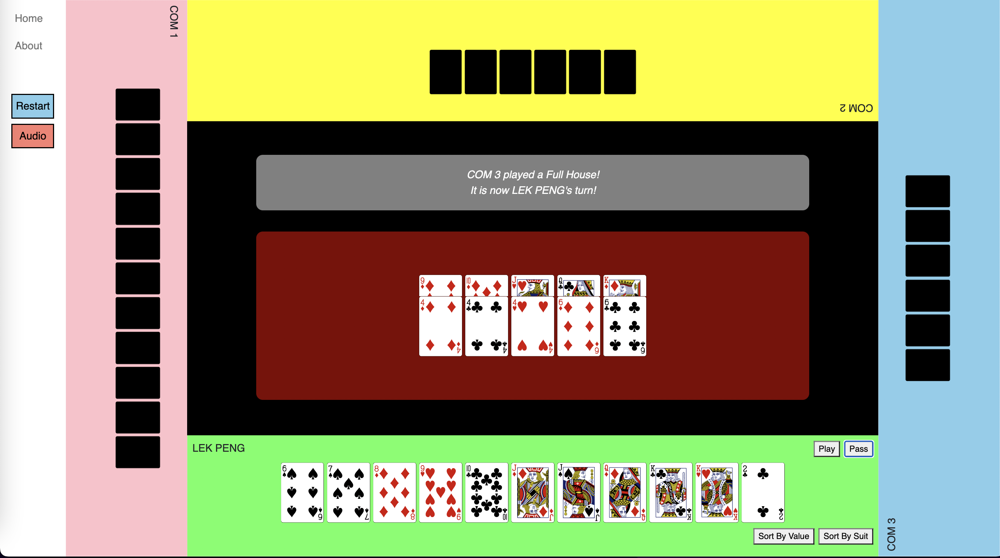
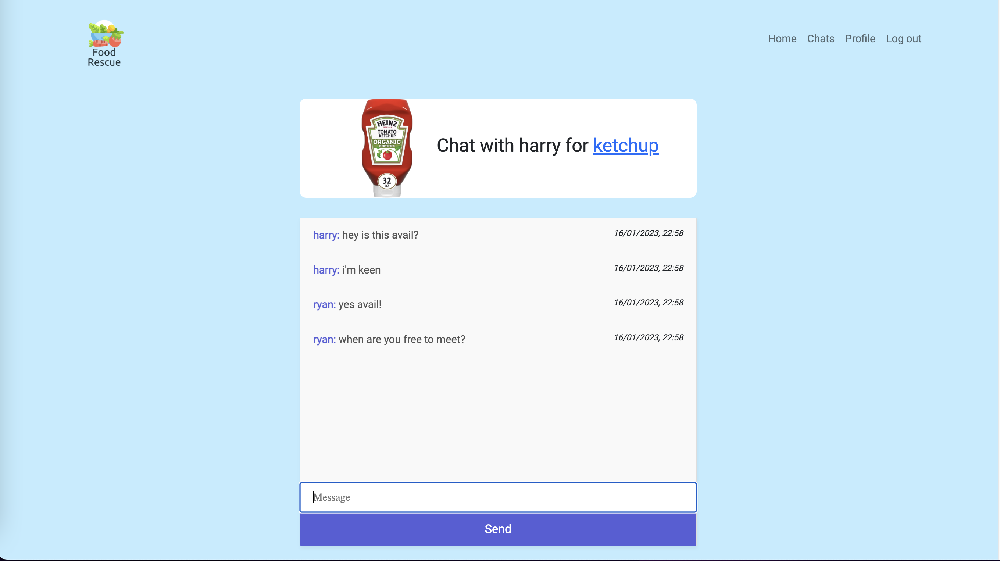
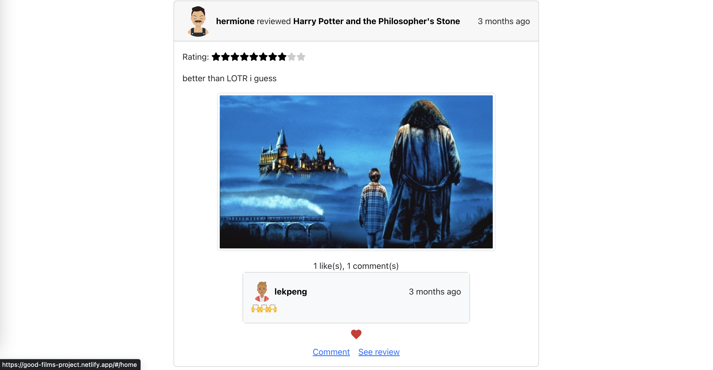
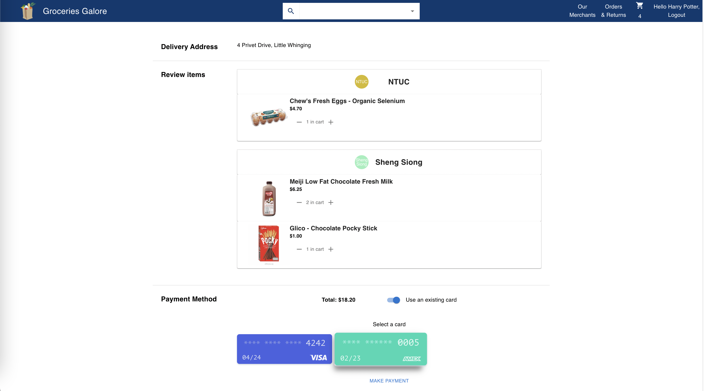

## Big Two

 Big Two is a web application based on the popular homonymous four-player card game. In the game, which was implemented with object oriented programming as the main programming paradigm, the human player plays against three "computer" players, and can perform four main actions: 

- sort cards in hand either by suit or value
- select cards
- play cards (i.e. add to pile)
- pass turn

Utilised: HTML, CSS, JavaScript

[Browse](https://lekpeng.github.io/big-2/)

---
## Food Rescue

 Food Rescue is a food-sharing site inspired by Olio, where users can easily give away and receive food that would have otherwise been thrown away. The site, which incorporates session authentication, allows users to post food listings, and interested parties to privately message the listing owners, thereby enabling everyone to play a part in reducing food wastage. 

Utilised: MongoDB, Express, EJS, Node, Bcrypt, Socket.io, Leaflet, Multer

[Browse](https://food-rescue.onrender.com)

---
## Good Films

 Good Films is a social platform developed by a team of three. Through this app, users can keep a virtual diary of films they've watched in their life time, and rate and review them. By implementing a "feed" system not unlike Facebook or Instagram, users can bond with like-minded peers over their favorite flicks through likes, comments and follows. 

Utilised: MongoDB, Express, React, Node, Axios, JWT, Luxon

[Browse](good-films-project.netlify.app)

---

## Groceries Galore

 Groceries Galore is an e-commerce site to buy and sell groceries. The ease of seeing the price of the same item from different merchants makes it more convenient for consumers to purchase groceries at competitive prices. The platform integrates credit card payment processing via Stripe, allowing for a quick and fuss-free experience for both merchant and consumer. Debouncing is also leveraged to reduce unnecessary API calls and improve application performance. 

Utilised: PostgreSQL, Express, React, Node, Nodemailer, Lodash, Stripe API

[Browse](https://groceries-galore.netlify.app)

